# The Qanvas guide

Qanvas teaches **q**, the array language behind kdb+, by drawing. It is a complete q interpreter plus a drawing studio, and it runs entirely in your browser, on a phone or a desktop, even offline.

This guide walks through every part of the app using phone screenshots. Everything works the same on a desktop, with more room (see [On a bigger screen](#on-a-bigger-screen)).

**Watch first:** the [47-second promo](../promo/qanvas-promo.mp4) shows the whole tour in motion.

- [Getting around](#getting-around)
- [Learn: lessons you can run](#learn-lessons-you-can-run)
- [Sketch: the studio](#sketch-the-studio)
- [Drawing in q, in five minutes](#drawing-in-q-in-five-minutes)
- [When something goes wrong](#when-something-goes-wrong)
- [The console](#the-console)
- [Dojo: practice problems](#dojo-practice-problems)
- [Ref: the living reference](#ref-the-living-reference)
- [Saving, sharing, installing](#saving-sharing-installing)
- [On a bigger screen](#on-a-bigger-screen)
- [Shortcuts](#shortcuts)

---

## Getting around

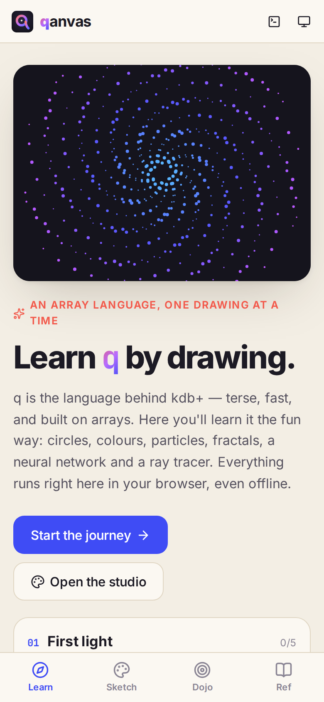

On a phone, the bar along the bottom holds the four sections:

| Tab | What it's for |
| --- | --- |
| **Learn** | 30 lessons in 9 chapters, from `til 10` to a ray tracer |
| **Sketch** | The studio: write q, watch it draw |
| **Dojo** | 33 short problems with instant checks |
| **Ref** | Every primitive and drawing function, with live examples |

The top bar has two buttons on the right: **Console** (a q prompt you can open from anywhere) and **Change theme** (it cycles system, light and dark).

Tap the **qanvas** logo to come back to the Learn home page. **Start the journey** opens the next lesson you haven't finished. **Open the studio** jumps straight to Sketch.

<br clear="right">

## Learn: lessons you can run

A lesson is a short read with runnable code in it. There are two kinds of cell.

<p>
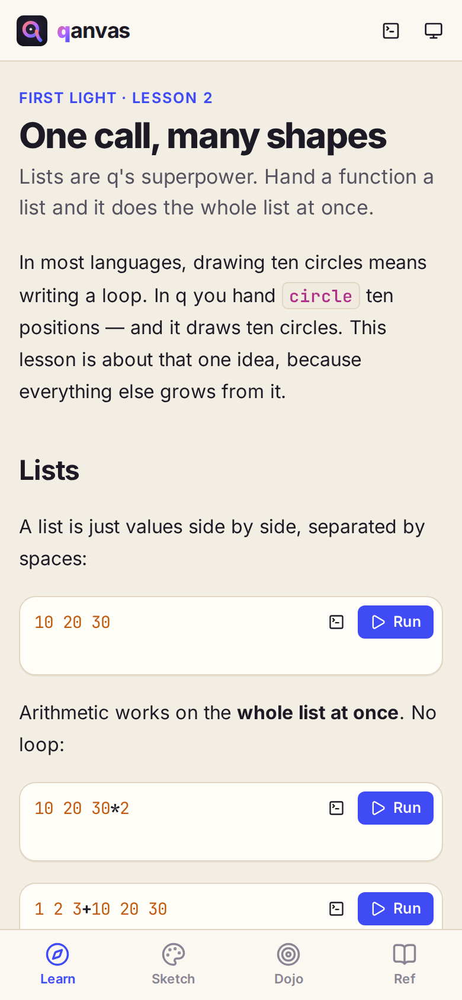
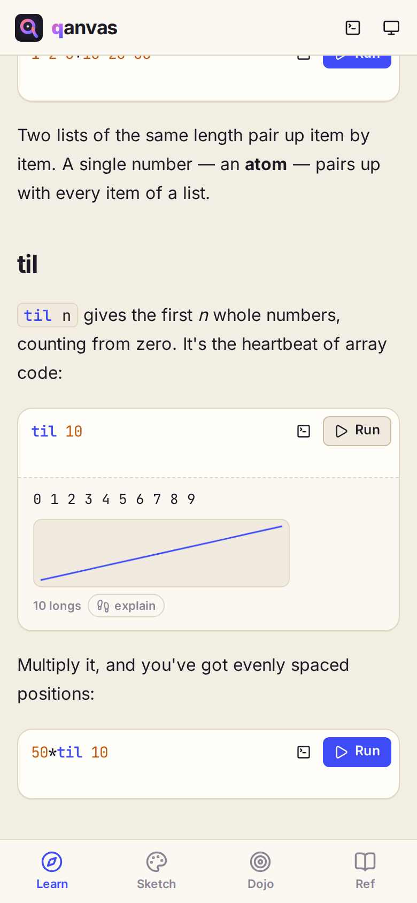
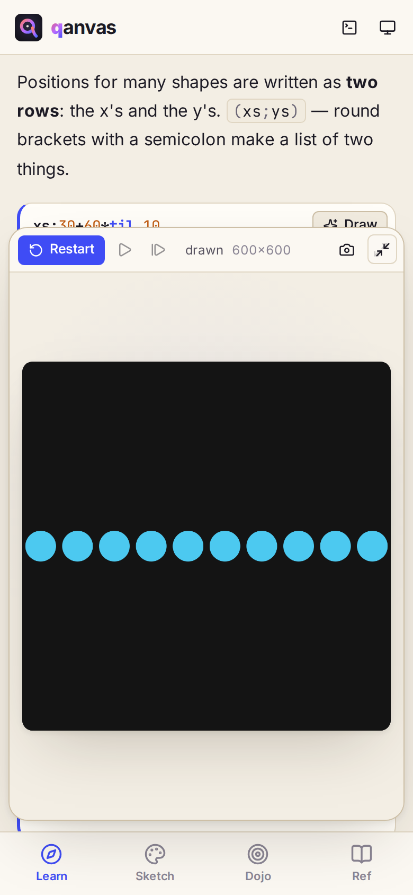
</p>

- **q cells** have a **Run** button. The result appears under the cell in q's own format. Number lists also get a small plot, and every result has an **explain** chip that steps through how q read the line, right to left. The terminal icon next to Run (**Try in console**) copies the code into the console so you can change it.
- **Sketch cells** have a coloured edge and a **Draw** button. They draw on the lesson's canvas, which slides up as a sheet on a phone.

You can edit any cell before you run it. Experiments are the point.

<p>
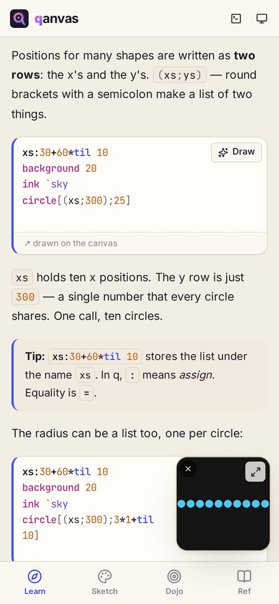
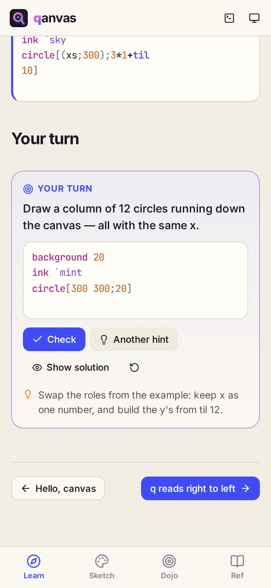
</p>

The expand/shrink button in the canvas toolbar turns the sheet into a small **mini canvas** that floats over the text. Drag it out of the way, tap it to open it again, or tap **×** to hide it until you next draw.

Every lesson ends in **Your turn**: a challenge with a goal, a starter, and checks. Press **Check** to test your answer. **Hint** reveals one hint at a time (the button becomes **Another hint**), **Show solution** gives it away, and the circular arrow resets the starter code. A solved challenge marks the lesson done, and the chapter counters on the home page (`0/5`) fill up.

## Sketch: the studio

The studio has three tabs on a phone: **Code**, **Canvas** and **Console**. (On a desktop they sit side by side.)

<p>

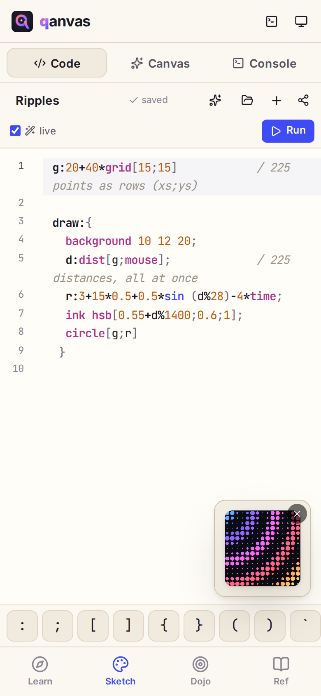
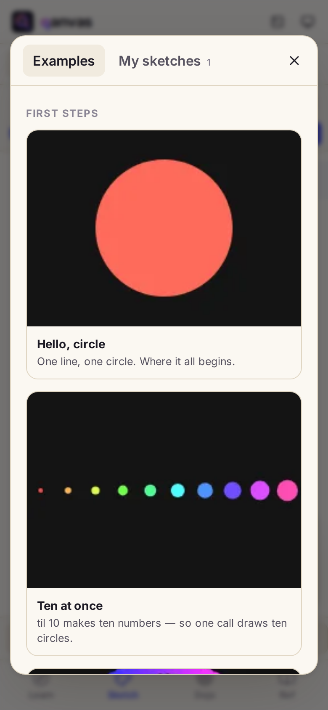
</p>

**Code tab**

- The sketch name at the top is editable. The little label next to it says **saving…** / **saved**.
- **live**: when ticked, the sketch re-runs by itself shortly after you stop typing, as long as the code parses. Untick it to run only when you press **Run** (or <kbd>Ctrl</kbd>+<kbd>Enter</kbd>).
- The icons along the top: ✦ **Examples**, 📁 **My sketches**, **+** new sketch, and **Share**.
- While a sketch runs, a **mini canvas** floats in the corner so you can watch it change as you type. Drag it anywhere, tap it to jump to the Canvas tab, or **×** to hide it until the next run.
- The **symbol bar** above the keyboard has the characters q uses most (`: ; [ ] { } ( ) \` "`) so you don't have to hunt for them on a phone keyboard.

**Canvas tab.** The toolbar has **Restart**, **Pause**, **Step one frame**, a status (`60 fps`, `drawn`, or `stopped`), the canvas size, a camera button to **save the canvas as a PNG**, and **full view**. Touch the canvas and the sketch sees your finger as `mouse`.

**Examples.** 21 ready-made sketches, from *Hello, circle* to *Ray tracer*. Tapping one opens a copy as a new sketch, so remix freely: the original stays in the gallery.

## Drawing in q, in five minutes

The canvas is 600×600 pixels. The top-left corner is `0 0`, and `center` is `300 300`.

**One shape.** A point is two numbers, `x y`. Functions take their arguments in square brackets, separated by `;`.

```q
background 20
ink `coral
circle[center;150]
```

**Many shapes, one call.** This is q's superpower. Give `circle` many positions as two rows, `(xs;ys)`, and it draws them all. Radii and colours can be lists too, one per shape.

```q
x:30+60*til 10
background 20
ink hsb[til[10]%10;0.7;1]
circle[(x;300);5+2*til 10]
```

**Animation.** Define a function called `draw` and Qanvas calls it 60 times a second. Inside it, `time` is the seconds since the start and `mouse` is where the pointer (or your finger) is.

```q
draw:{
  background 20
  ink hsb[time%5;0.6;1]
  circle[mouse;40+20*sin 3*time]
 }
```

**Setup and state.** `setup` runs once before the first frame. Leave out `background` in `draw` and every frame paints over the last, leaving trails. To change a global from inside a function, use `::`.

```q
n:0
setup:{background 20}
draw:{
  n::n+1
  ink $[mousedown;`coral;`sky]
  circle[mouse;10]
 }
```

**One statement per line.** A new line ends a statement, inside `{ }` too, so a `;` at the end of a line is optional. Use `;` when you want several statements on one line (``ink `coral; circle[center;50]``). Inside `( )` and `[ ]` a new line is just a space, so long lists and function calls can span lines.

**Where to look things up.** The most-used names:

| | |
| --- | --- |
| Shapes | `circle` `ellipse` `rect` `square` `line` `point` `tri` `arc` `poly` `path` `curve` `blob` `text` |
| Style | `background` `ink` (fill) `pen` (outline) `weight` `alpha` `blend` `font` `align` |
| Colour | named colours like `` `coral `sky `mint ``, `rgb[r;g;b]`, `hsb[h;s;b]`, `gray v` |
| Transform | `move` `turn` `zoom` `push[]` `pop[]` |
| Input | `mouse` `mousedown` `clicked` `touches` `held` `pressed` `time` `frame` `dt` |
| Helpers | `grid[w;h]` `ring n` `polar[r;a]` `dist[a;b]` `noise` `lerp` `clamp` `remap` `pi` `tau` |
| Images | `pixels m` `heatmap m` |
| Sound & camera | `tone[freq;secs]` `mic[]` `camera 64 48` |

Every one of them has a page in [Ref](#ref-the-living-reference) with runnable examples.

## When something goes wrong

<p>
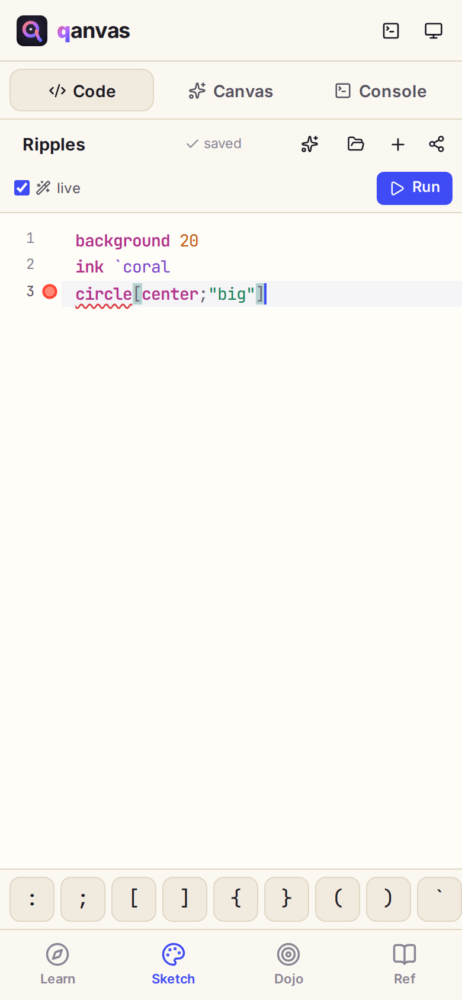
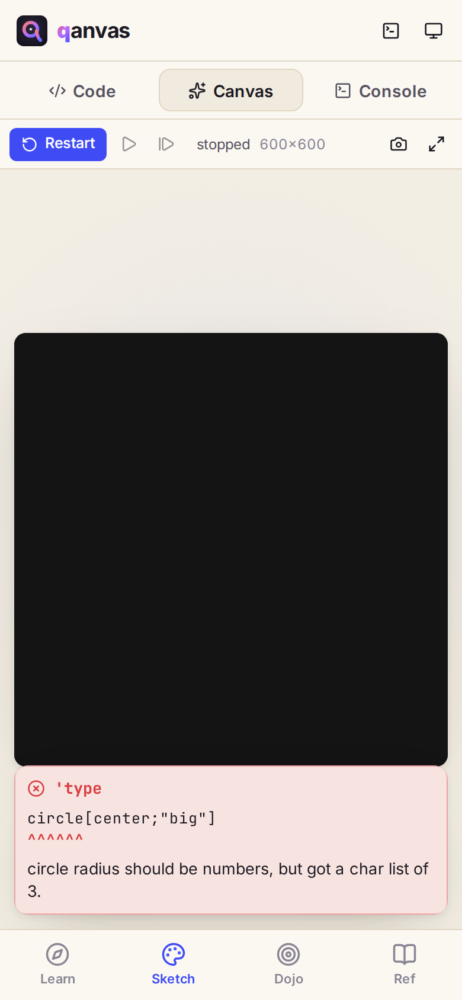
</p>

Errors look like real q errors (`'type`, `'length`, `'rank`…) with a caret under the exact spot, and then a plain-English explanation of what went wrong. The card appears under the canvas. In the editor the same spot is underlined, with a red dot in the gutter; hover it to read the message. With **live** on, every edit re-runs the sketch, so the card goes away as soon as the code works again.

## The console

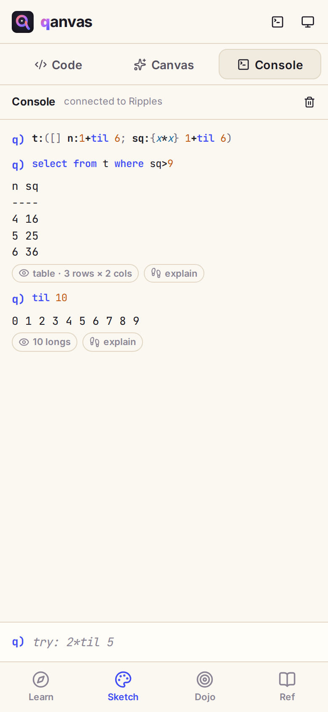

The console is a q prompt. Open it from the **Console** tab in the studio, from the top bar anywhere in the app, or with <kbd>Ctrl</kbd>+<kbd>`</kbd>. It shares its session with the running sketch ("connected to Ripples"), so you can inspect a sketch's variables while it draws.

Try tables and qSQL:

```q
t:([] n:1+til 6; sq:{x*x} 1+til 6)
select from t where sq>9
```

Output is printed the way q prints it. Chips under a result describe its shape (`table · 3 rows × 2 cols`), and **explain** walks through the evaluation step by step. Use the up and down arrows to recall earlier lines, and the bin icon to clear.

<br clear="right">

## Dojo: practice problems

<p>
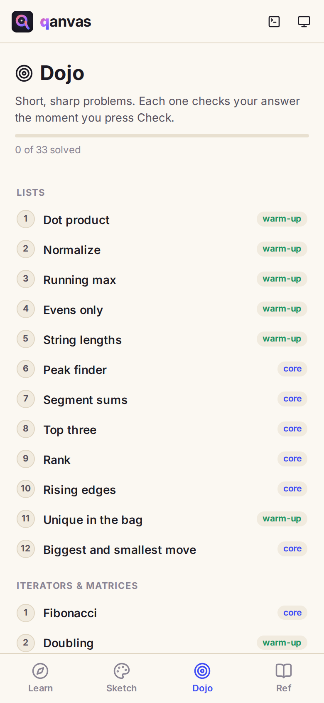
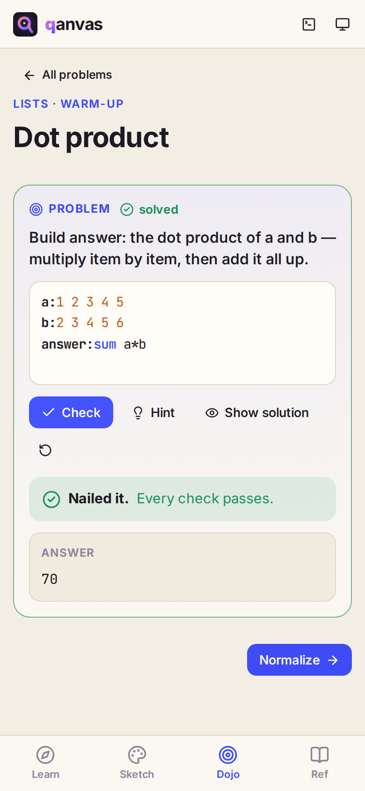
</p>

33 short problems in four sets (lists, iterators and matrices, tables, drawing), each tagged **warm-up** or **core**. Every problem is a challenge like the ones at the end of lessons: change the code so it builds the `answer`, press **Check**, and every check has to pass. Solved problems are ticked and counted in the progress bar (`0 of 33 solved`). The arrow button at the bottom takes you to the next problem.

## Ref: the living reference

<p>
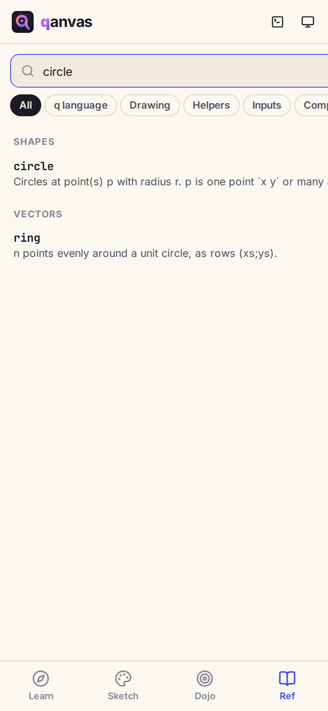
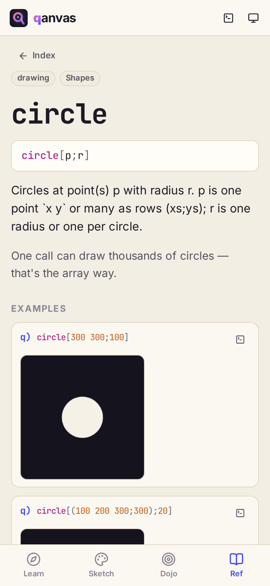
</p>

Every q primitive, keyword, iterator and Qanvas function has a page: its signature, what it does, the gotchas, and **examples that actually run**, drawing ones included. Search from the box at the top, or filter by kind (**q language**, **Drawing**, **Helpers**, **Inputs**…). The terminal icon on each example sends it to the console, and **See also** links related entries. Hovering a name in the editor shows its reference summary too.

## Saving, sharing, installing

- **Saving is automatic.** Sketches are saved in your browser as you type. Find them again under **My sketches** (the folder icon). Lesson progress and Dojo answers are saved the same way. Nothing is uploaded anywhere.
- **Sharing** (the share icon) copies a link with the whole sketch inside it. Whoever opens it gets their own copy to play with; no account or server is involved.
- **Installing.** Qanvas is a Progressive Web App. Use your browser's *Add to Home Screen* / *Install app* and it opens full-screen like a native app and works with no connection.
- **Save as PNG** from the canvas toolbar downloads the current frame.

## On a bigger screen

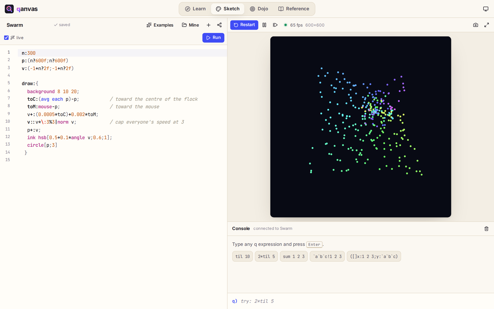

On a desktop the tabs move to the top bar (**Learn**, **Sketch**, **Dojo**, **Reference**), and the studio shows code, canvas and console side by side. Lessons get a sidebar for jumping between lessons, and the lesson canvas sits beside the text instead of sliding up as a sheet.

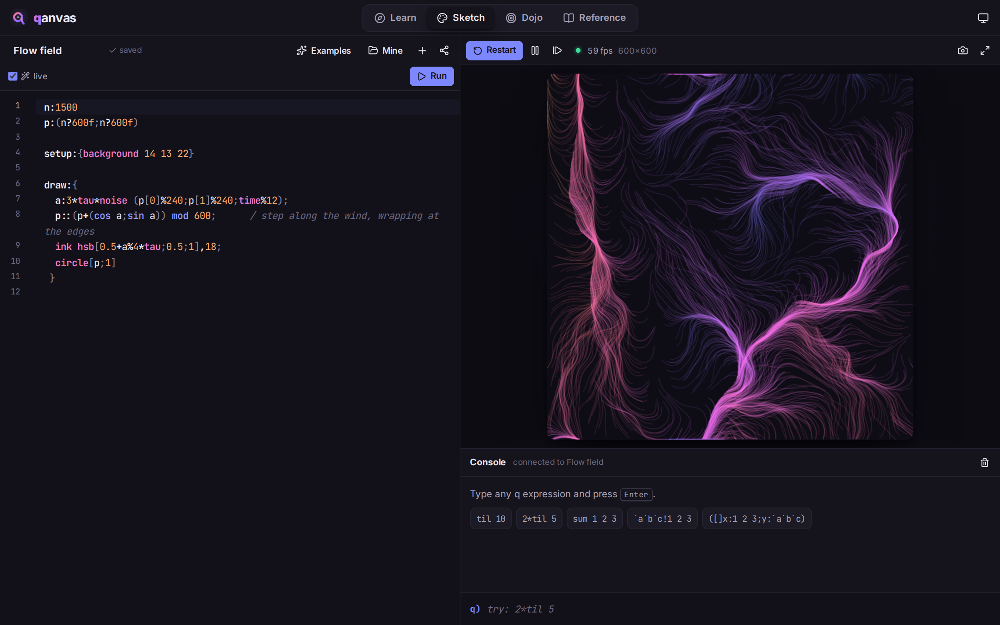

The theme button in the top bar switches between system, light and dark.

## Shortcuts

| Keys | Does |
| --- | --- |
| <kbd>Ctrl</kbd>/<kbd>⌘</kbd>+<kbd>Enter</kbd> | Run the sketch or cell |
| <kbd>Ctrl</kbd>/<kbd>⌘</kbd>+<kbd>/</kbd> | Comment or uncomment the line |
| <kbd>Ctrl</kbd>/<kbd>⌘</kbd>+<kbd>`</kbd> | Open or close the console |
| <kbd>Tab</kbd> | Indent (inside the editor) |

---

*kdb+ and q are trademarks of KX Systems. Qanvas is an independent learning project, not affiliated with or endorsed by KX.*
